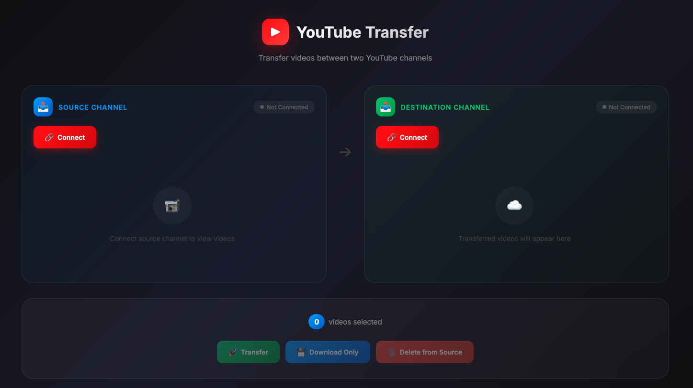

# YouTube Transfer

A local web tool to transfer videos between two YouTube channels. Includes a Chrome extension for automated YouTube Studio uploads.


## Screenshot



## Features

- **OAuth Authentication** - Connect two YouTube channels securely
- **Video Transfer** - Download from source, upload to destination, delete from source
- **Download Only** - Download videos with metadata for manual upload
- **Delete from Source** - Clean up source channel after transfer
- **Shorts Support** - Automatically detects and handles YouTube Shorts
- **Chrome Extension** - Auto-fill metadata in YouTube Studio

## Requirements

- Node.js (v18+)
- yt-dlp (`brew install yt-dlp`)
- YouTube API credentials from [Google Cloud Console](https://console.cloud.google.com/)

## Setup

### 1. Clone the repository

```bash
git clone https://github.com/umutcetinkaya/youtube-transfer.git
cd youtube-transfer
npm install
```

### 2. Configure YouTube API

1. Go to [Google Cloud Console](https://console.cloud.google.com/)
2. Create a new project or select existing
3. Enable **YouTube Data API v3**
4. Create OAuth 2.0 credentials:
   - Application type: **Web application**
   - Authorized redirect URI: `http://localhost:3000/auth/callback`
5. Configure OAuth consent screen

### 3. Set environment variables

```bash
cp .env.example .env
```

Edit `.env`:
```
YOUTUBE_CLIENT_ID=your-client-id.apps.googleusercontent.com
YOUTUBE_CLIENT_SECRET=your-client-secret
PORT=3000
```

### 4. Install yt-dlp

```bash
# macOS
brew install yt-dlp

# or with pip
pip install yt-dlp
```

## Usage

### Start the server

```bash
npm start
```

Open http://localhost:3000

### Transfer videos

1. Click **Connect** on Source Channel → OAuth login
2. Click **Connect** on Destination Channel → OAuth login (different account)
3. Select videos from source channel
4. Click **Transfer** to move videos

### Download only (to bypass API limits)

1. Connect source channel
2. Select videos
3. Click **Download Only**
4. Videos saved to `~/Downloads/youtube-transfer/`

## Chrome Extension

The extension auto-fills metadata when uploading to YouTube Studio manually.

### Install extension

1. Open `chrome://extensions`
2. Enable **Developer mode**
3. Click **Load unpacked**
4. Select the `extension/` folder

### Use extension

1. Download videos using "Download Only" in the web app
2. Click extension popup → Select video → **Open in YouTube Studio**
3. Select the video file (path is copied to clipboard)
4. Metadata auto-fills → Click **Publish**

## API Limits

YouTube API has daily quotas:
- ~6 video uploads per day via API
- Use "Download Only" + manual upload to bypass limits

## Project Structure

```
youtube-transfer/
├── server.js           # Express server + OAuth + API
├── public/
│   └── index.html      # Web UI
├── extension/          # Chrome extension
│   ├── manifest.json
│   ├── popup.html/js
│   ├── content.js/css
│   └── background.js
├── .env.example
└── package.json
```

## Disclaimer

This tool is for personal use and educational purposes only. Please ensure you:

- ✅ Only transfer videos you own or have permission to use
- ✅ Comply with YouTube's Terms of Service
- ✅ Respect copyright laws and intellectual property rights
- ✅ Do not use this tool to download or distribute copyrighted content without authorization

The authors are not responsible for any misuse of this software.

## Contributing

Contributions are welcome! Here's how you can help:

### Reporting Bugs

1. Check if the bug is already reported in [Issues](https://github.com/umutcetinkaya/youtube-transfer/issues)
2. If not, create a new issue with:
   - Clear description of the bug
   - Steps to reproduce
   - Expected vs actual behavior
   - Your environment (OS, Node.js version, browser)
   - Screenshots if applicable

### Suggesting Features

1. Open an issue with the `enhancement` label
2. Describe the feature and its use case
3. Explain why it would be useful

### Contributing Code

1. Fork the repository
2. Create a feature branch: `git checkout -b feature/your-feature-name`
3. Make your changes
4. Test thoroughly
5. Commit with clear messages: `git commit -m "Add feature: description"`
6. Push to your fork: `git push origin feature/your-feature-name`
7. Open a Pull Request

### Code Guidelines

- Use consistent indentation (2 spaces)
- Add comments for complex logic
- Follow existing code style
- Test your changes before submitting

## License

MIT License - see [LICENSE](LICENSE) file for details
